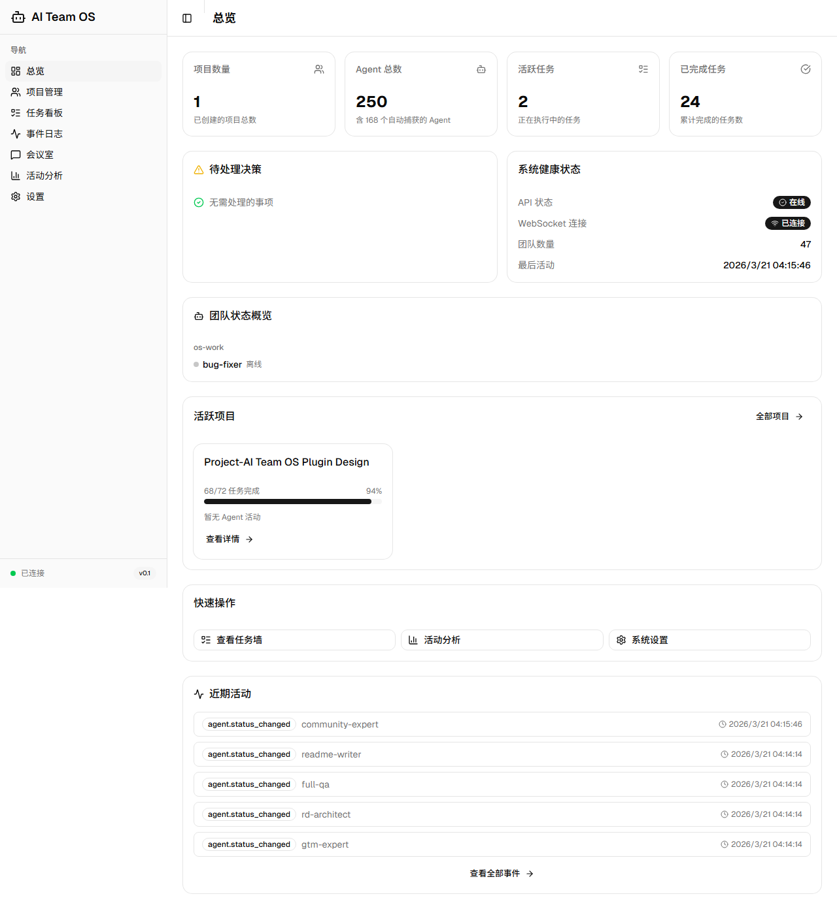
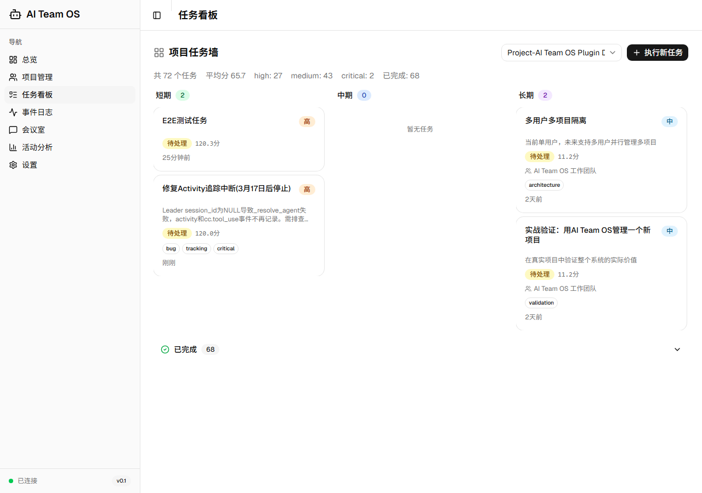
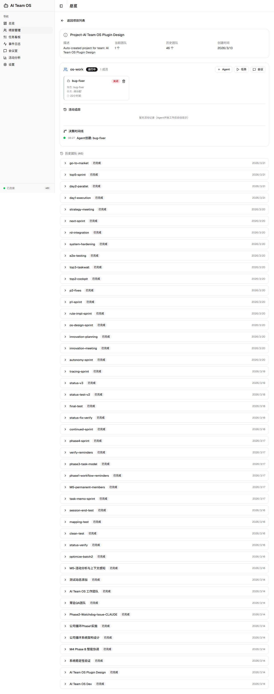
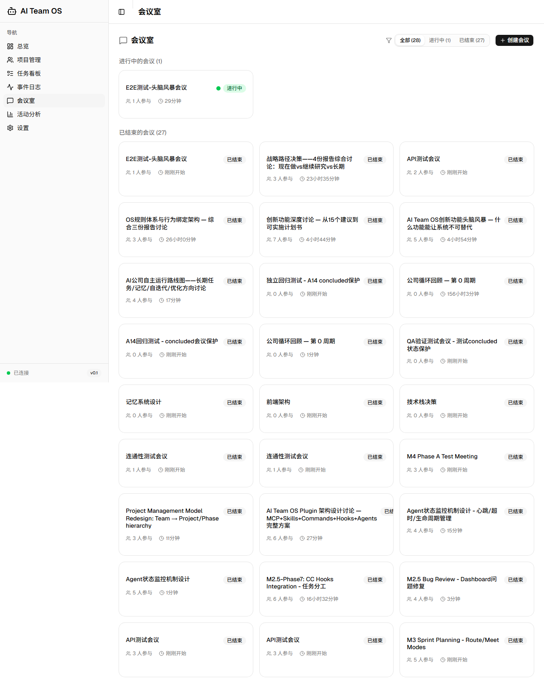
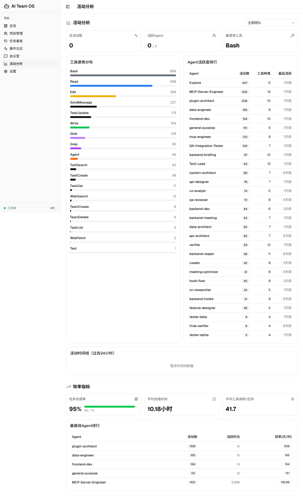
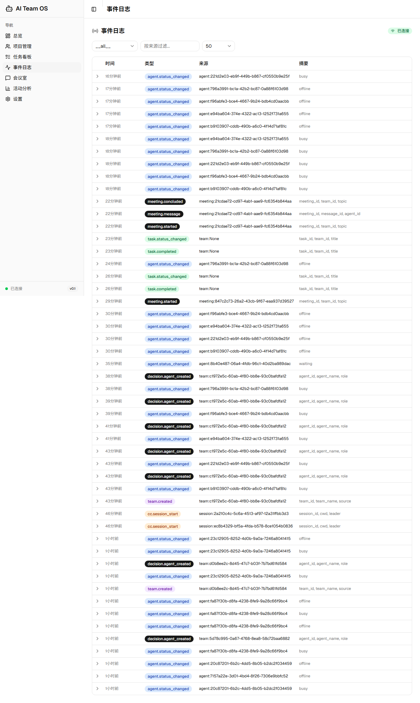

# AI Team OS

<!-- Logo placeholder -->
<!--  -->

**The Operating System for AI Agent Teams** · AI Agent 团队操作系统

[](https://python.org)
[](LICENSE)
[](https://fastapi.tiangolo.com)
[](https://react.dev)
[](https://modelcontextprotocol.io)
[](https://github.com/CronusL-1141/AI-company)

---

> **Claude Code 是单兵作战工具。AI Team OS 让它具备团队运转能力。**
>
> *Claude Code is a solo tool. AI Team OS gives it the power of a full team.*

---

AI Team OS 是一个叠加在 Claude Code 之上的 **增强层操作系统**，通过 MCP 协议 + Hook 系统 + Agent 模板，将单个 Claude Code 实例变成一支能够自主运转的 AI 团队。它不是另一个 LLM 框架——它是让 AI 团队**真正像公司一样运转**的基础设施。

**30秒内，你能得到什么：**
- 一支有分工、有记忆、能开会、会自我纠错的 AI 团队
- 每次失败自动分析根因，下次类似任务提前预警
- 可视化指挥中心——实时追踪每个 Agent 在做什么、为什么这样做

---

## 为什么需要 AI Team OS？

### 痛点

| 现状 | 问题 |
|------|------|
| Claude Code 单实例运行 | 无法并行处理复杂多角色任务 |
| 任务失败即遗忘 | 同类错误反复出现，没有学习闭环 |
| 决策过程不透明 | 用户不知道 Agent 为什么这样做 |
| 任务分配靠手动 | 没有基于能力数据的智能匹配 |
| 无会议协作机制 | 多 Agent 讨论缺乏结构化流程 |

### AI Team OS 的解法

AI Team OS 在 Claude Code 之上加一层 **OS 增强层**，通过四个维度改变团队运转方式：

```
可解释  — 每个决策有迹可循，支持时间线回溯和意图透视
可学习  — 系统从失败中提取模式，持续改进执行策略
可自适应 — 任务墙实时响应事件，智能匹配最佳 Agent
可管理  — Dashboard 实时展示团队状态，一键介入或暂停
```

### 与主流方案对比

| 维度 | AI Team OS | CrewAI | AutoGen | LangGraph | Devin |
|------|-----------|--------|---------|-----------|-------|
| **定位** | CC 增强层 OS | 独立框架 | 独立框架 | 工作流引擎 | 独立 AI 工程师 |
| **集成方式** | MCP 协议接入 CC | 独立 Python 运行 | 独立 Python 运行 | 独立 Python 运行 | SaaS 独立产品 |
| **会议系统** | 7 种结构化模板 | 无 | 有限 | 无 | 无 |
| **失败学习** | 失败炼金术（抗体/疫苗/催化剂） | 无 | 无 | 无 | 有限 |
| **决策透明度** | 决策驾驶舱 + 时间线 | 无 | 有限 | 有限 | 黑盒 |
| **规则体系** | 四层防线（48+ 条） | 有限 | 有限 | 无 | 有限 |
| **Agent 模板** | 22 个开箱即用 | 内置角色 | 内置角色 | 无 | 无 |
| **Dashboard** | React 19 可视化 | 商业版 | 无 | 无 | 有 |
| **开源** | MIT | Apache 2.0 | MIT | MIT | 否 |
| **Claude Code 原生** | ✅ 深度集成 | ❌ | ❌ | ❌ | ❌ |

---

## 核心特性

### 🏢 团队编排
- **22 个专业 Agent 模板**，覆盖工程/测试/研究/管理四大领域，开箱即用
- **部门分组管理**，支持工程部/测试部/研究部等多部门结构
- **智能 Agent 匹配**，基于任务特征自动推荐最适合的 Agent

### 📋 任务管理
- **事件驱动任务墙 2.0**，实时推送任务状态变更，无需轮询
- **Loop 引擎**，自动推进任务生命周期，含 AWARE 循环 + 卡死检测
- **What-If 分析器**，多方案对比推荐，支持路径模拟

### 🤝 会议系统
- **7 种结构化会议模板**（头脑风暴/决策会/技术评审/复盘会/状态同步/专家咨询/冲突解决）
- 基于六顶思考帽 + DACI 框架 + Design Sprint 等经典方法论
- 每次会议必须产出可执行结论，不允许"讨论了但没决定"

### 🛡️ 质量保障
- **失败炼金术**：每次失败自动提取模式 → 归类根因 → 生成改进建议，构建学习闭环
  - 抗体：失败经验存入记忆，防止同类错误重现
  - 疫苗：高频失败模式转化为任务前预警
  - 催化剂：失败分析结果注入 Agent 的 system prompt，改善下次执行
- **四层防线规则体系**：意识层(CLAUDE.md) → 引导层(SessionStart) → 执法层(PreToolUse) → 契约层(MCP校验)
- **安全护栏**，14 条核心安全规则，阻止危险操作

### 📊 Dashboard 指挥中心
- **决策驾驶舱**：事件流 + 决策时间线 + 意图透视，每个决策有迹可循
- **活动追踪**：实时展示每个 Agent 的状态和当前任务
- **部门全景视图**：一屏掌握整支团队动态

### 🧠 团队活记忆
- **知识共享**：Agent 的工作成果沉淀为团队知识，可跨任务检索
- **经验传承**：失败经验和成功模式系统化存储，新任务自动参考
- **AWARE 循环**：感知 → 记录 → 提炼 → 应用的完整记忆回路

### 🔧 40+ MCP 工具
通过 MCP 协议一键接入，无需额外配置，与 Claude Code 深度原生集成。

### 📐 规则注入体系
- **30+ 条 B 规则**（业务行为规范）+ **18 条 A 规则**（架构约束）
- Leader 自主运转规则植入 OS，减少用户干预需求

---

## 系统架构

```
┌─────────────────────────────────────────────────────────────────┐
│                     用户（董事长）                                │
│                         │                                       │
│                         ▼                                       │
│                   Leader（CEO）                                  │
│            ┌────────────┼────────────┐                          │
│            ▼            ▼            ▼                          │
│       Agent模板      任务墙        会议系统                        │
│      (22个角色)    Loop引擎      (7种模板)                         │
│            │            │            │                          │
│            └────────────┼────────────┘                          │
│                         ▼                                       │
│              ┌──────────────────────┐                           │
│              │   OS 增强层           │                           │
│              │  ┌──────────────┐    │                           │
│              │  │  MCP Server  │    │                           │
│              │  │  (40+ tools) │    │                           │
│              │  └──────┬───────┘    │                           │
│              │         │            │                           │
│              │  ┌──────▼───────┐    │                           │
│              │  │  FastAPI     │    │                           │
│              │  │  REST API    │    │                           │
│              │  └──────┬───────┘    │                           │
│              │         │            │                           │
│              │  ┌──────▼───────┐    │                           │
│              │  │  Dashboard   │    │                           │
│              │  │ (React 19)   │    │                           │
│              │  └──────────────┘    │                           │
│              └──────────────────────┘                           │
│                         │                                       │
│              ┌──────────▼──────────┐                            │
│              │  Storage (SQLite)   │                            │
│              │  + Memory System    │                            │
│              └─────────────────────┘                            │
└─────────────────────────────────────────────────────────────────┘
```

### 五层技术架构

```
Layer 5: Web Dashboard    — React 19 + TypeScript + Shadcn UI
Layer 4: CLI + REST API   — Typer + FastAPI
Layer 3: Team Orchestrator — LangGraph StateGraph
Layer 2: Memory Manager   — Mem0 / File fallback
Layer 1: Storage          — SQLite (开发) / PostgreSQL (生产)
```

### Hook 系统（CC 与 OS 的桥梁）

```
SessionStart   → session_bootstrap.py   — 注入Leader简报 + 规则集 + 团队状态
SubagentStart  → inject_subagent_context.py — 注入子Agent OS规则（2-Action等）
PreToolUse     → workflow_reminder.py   — 工作流提醒 + 安全护栏
PostToolUse    → send_event.py          — 事件转发到 OS API
UserPromptSubmit → context_monitor.py  — 上下文使用率监控
```

---

## 快速开始

### 前置要求

- Python >= 3.11
- Claude Code（需要 MCP 支持）
- Node.js >= 20（Dashboard 前端，可选）

### 三步启动

```bash
# Step 1: 克隆仓库
git clone https://github.com/CronusL-1141/AI-company.git
cd AI-company/ai-team-os

# Step 2: 安装（自动配置 MCP + Hooks）
python install.py

# Step 3: 重启 Claude Code，OS 自动激活
# 验证：在 CC 中运行 → /mcp 查看 ai-team-os 工具是否挂载
```

### 验证安装

```bash
# 检查 OS 健康状态
curl http://localhost:8000/health
# 期望: {"status": "ok", "version": "0.1.0"}

# 通过 CC 创建第一个团队
# 在 Claude Code 中输入：
# "帮我创建一个 web 开发团队，包含前端、后端和测试工程师"
```

### 启动 Dashboard

```bash
cd dashboard
npm install
npm run dev
# 访问 http://localhost:5173
```

---

## Dashboard 截图

### 指挥中心


### 任务看板


### 项目详情 & 决策时间线


### 会议室


### 活动分析


### 事件日志


---

## MCP 工具一览

<details>
<summary>展开查看全部 40+ MCP 工具</summary>

### 团队管理

| 工具 | 说明 |
|------|------|
| `team_create` | 创建 AI Agent 团队，支持 coordinate/broadcast 模式 |
| `team_status` | 获取团队详情和成员状态 |
| `team_list` | 列出所有团队 |
| `team_briefing` | 一次调用获取团队全景简报（成员+事件+会议+待办） |
| `team_setup_guide` | 根据项目类型推荐团队角色配置 |

### Agent 管理

| 工具 | 说明 |
|------|------|
| `agent_register` | 注册新 Agent 到团队 |
| `agent_update_status` | 更新 Agent 状态（idle/busy/error） |
| `agent_list` | 列出团队成员 |
| `agent_template_list` | 获取可用的 Agent 模板列表 |
| `agent_template_recommend` | 根据任务描述推荐最适合的 Agent 模板 |

### 任务管理

| 工具 | 说明 |
|------|------|
| `task_run` | 执行任务并记录全程 |
| `task_decompose` | 将复杂任务分解为子任务 |
| `task_status` | 查询任务执行状态 |
| `taskwall_view` | 查看任务墙（全部待办+进行中+已完成） |
| `task_create` | 创建新任务 |
| `task_auto_match` | 基于任务特征智能匹配最佳 Agent |
| `task_memo_add` | 为任务添加执行备忘记录 |
| `task_memo_read` | 读取任务历史备忘 |

### Loop 循环引擎

| 工具 | 说明 |
|------|------|
| `loop_start` | 启动自动推进循环 |
| `loop_status` | 查看循环状态 |
| `loop_next_task` | 获取下一个待处理任务 |
| `loop_advance` | 推进循环到下一阶段 |
| `loop_pause` | 暂停循环 |
| `loop_resume` | 恢复循环 |
| `loop_review` | 生成循环回顾报告（含失败分析） |

### 会议系统

| 工具 | 说明 |
|------|------|
| `meeting_create` | 创建结构化会议（支持7种模板） |
| `meeting_send_message` | 发送会议消息 |
| `meeting_read_messages` | 读取会议记录 |
| `meeting_conclude` | 总结会议结论 |
| `meeting_template_list` | 获取可用会议模板列表 |

### 智能分析

| 工具 | 说明 |
|------|------|
| `failure_analysis` | 失败炼金术——分析失败根因，生成抗体/疫苗/催化剂 |
| `what_if_analysis` | What-If 分析器——多方案对比推荐 |
| `decision_log` | 记录决策到驾驶舱时间线 |
| `context_resolve` | 解析当前上下文，获取相关背景信息 |

### 记忆系统

| 工具 | 说明 |
|------|------|
| `memory_search` | 全文检索团队记忆库 |
| `team_knowledge` | 获取团队知识摘要 |

### 项目管理

| 工具 | 说明 |
|------|------|
| `project_create` | 创建项目 |
| `phase_create` | 创建项目阶段 |
| `phase_list` | 列出项目阶段 |

### 系统运维

| 工具 | 说明 |
|------|------|
| `os_health_check` | OS 健康检查 |
| `event_list` | 查看系统事件流 |
| `os_report_issue` | 上报问题 |
| `os_resolve_issue` | 标记问题已解决 |

</details>

---

## Agent 模板库

22 个开箱即用的专业 Agent 模板，覆盖完整软件工程团队配置：

### 工程部（Engineering）

| 模板名 | 角色 | 适用场景 |
|--------|------|---------|
| `engineering-software-architect` | 软件架构师 | 系统设计、架构评审 |
| `engineering-backend-architect` | 后端架构师 | API 设计、服务架构 |
| `engineering-frontend-developer` | 前端开发工程师 | UI 实现、交互开发 |
| `engineering-ai-engineer` | AI 工程师 | 模型集成、LLM 应用 |
| `engineering-mcp-builder` | MCP 构建专家 | MCP 工具开发 |
| `engineering-database-optimizer` | 数据库优化师 | 查询优化、Schema 设计 |
| `engineering-devops-automator` | DevOps 自动化工程师 | CI/CD、基础设施 |
| `engineering-sre` | 站点可靠性工程师 | 可观测性、故障处理 |
| `engineering-security-engineer` | 安全工程师 | 安全审查、漏洞分析 |
| `engineering-rapid-prototyper` | 快速原型工程师 | MVP 验证、快速迭代 |
| `engineering-mobile-developer` | 移动端开发工程师 | iOS/Android 开发 |
| `engineering-git-workflow-master` | Git 工作流专家 | 分支策略、代码协作 |

### 测试部（Testing）

| 模板名 | 角色 | 适用场景 |
|--------|------|---------|
| `testing-qa-engineer` | QA 工程师 | 测试策略、质量保障 |
| `testing-api-tester` | API 测试专家 | 接口测试、契约测试 |
| `testing-bug-fixer` | Bug 修复专家 | 缺陷分析、根因排查 |
| `testing-performance-benchmarker` | 性能基准测试师 | 性能分析、压测 |

### 研究与支持（Research & Support）

| 模板名 | 角色 | 适用场景 |
|--------|------|---------|
| `specialized-workflow-architect` | 工作流架构师 | 流程设计、自动化编排 |
| `support-technical-writer` | 技术文档工程师 | API 文档、用户指南 |
| `support-meeting-facilitator` | 会议主持人 | 结构化讨论、决策推进 |

### 管理层（Management）

| 模板名 | 角色 | 适用场景 |
|--------|------|---------|
| `management-tech-lead` | 技术 Lead | 技术决策、团队协调 |
| `management-project-manager` | 项目经理 | 进度管理、风险跟踪 |

### 专项模板

| 模板名 | 角色 | 适用场景 |
|--------|------|---------|
| `python-reviewer` | Python 代码审查 | Python 项目代码质量 |
| `security-reviewer` | 安全审查 | 代码安全扫描 |
| `refactor-cleaner` | 重构清理专家 | 技术债清理 |
| `tdd-guide` | TDD 引导 | 测试驱动开发 |

---

## 路线图

### 已完成 ✅

- [x] 核心 Loop 引擎（LoopEngine + 任务墙 + Watchdog + 回顾）
- [x] TOP1 失败炼金术（抗体 + 疫苗 + 催化剂）
- [x] TOP2 决策驾驶舱（事件流 + 时间线 + 意图透视）
- [x] TOP3 事件驱动任务墙 2.0（实时推送 + 智能匹配）
- [x] TOP4 团队活记忆（知识查询 + 经验共享）
- [x] TOP5 What-If 分析器（多方案对比推荐）
- [x] 7 种结构化会议模板
- [x] 22 个专业 Agent 模板
- [x] 四层防线规则体系（30+ B规则 + 18 A规则）
- [x] Dashboard 指挥中心（React 19）
- [x] 40+ MCP 工具
- [x] AWARE 循环记忆系统

### 进行中 / 计划中

- [ ] 多用户隔离（Multi-tenant 支持）
- [ ] 实战验证与性能优化
- [ ] Claude Code Plugin Marketplace 上架
- [ ] 完整集成测试套件
- [ ] 文档网站（Docusaurus）
- [ ] 视频教程系列

---

## 项目结构

```
ai-team-os/
├── src/aiteam/
│   ├── api/           — FastAPI REST 端点
│   ├── mcp/           — MCP Server（40+ tools）
│   ├── loop/          — Loop 引擎
│   ├── meeting/       — 会议系统
│   ├── memory/        — 团队记忆
│   ├── orchestrator/  — 团队编排器
│   ├── storage/       — 存储层（SQLite/PostgreSQL）
│   ├── templates/     — Agent 模板基类
│   ├── hooks/         — CC Hook 脚本
│   └── types.py       — 共享类型定义
├── dashboard/         — React 19 前端
├── docs/              — 设计文档（14份）
├── tests/             — 测试套件
├── install.py         — 一键安装脚本
└── pyproject.toml
```

---

## 贡献指南

欢迎贡献！特别期待以下方向：

- **新 Agent 模板**：如果你有专业角色的提示词设计，欢迎 PR
- **会议模板扩展**：新的结构化讨论模式
- **Bug 修复**：提 Issue 或直接 PR
- **文档改善**：发现文档与代码不一致，欢迎纠正

```bash
# 开发环境搭建
git clone https://github.com/CronusL-1141/AI-company.git
cd AI-company/ai-team-os
pip install -e ".[dev]"
pytest tests/
```

提 PR 前请确保：
- `ruff check src/` 通过
- `mypy src/` 无新增错误
- 相关测试通过

---

## License

MIT License — 详见 [LICENSE](LICENSE)

---

<div align="center">

**AI Team OS** — 让 AI 团队真正像公司一样运转

*Built with Claude Code · Powered by MCP Protocol*

[文档](docs/) · [Issues](https://github.com/CronusL-1141/AI-company/issues) · [讨论区](https://github.com/CronusL-1141/AI-company/discussions)

</div>
